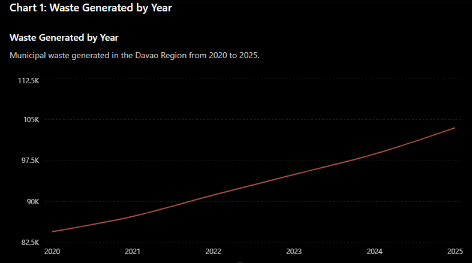
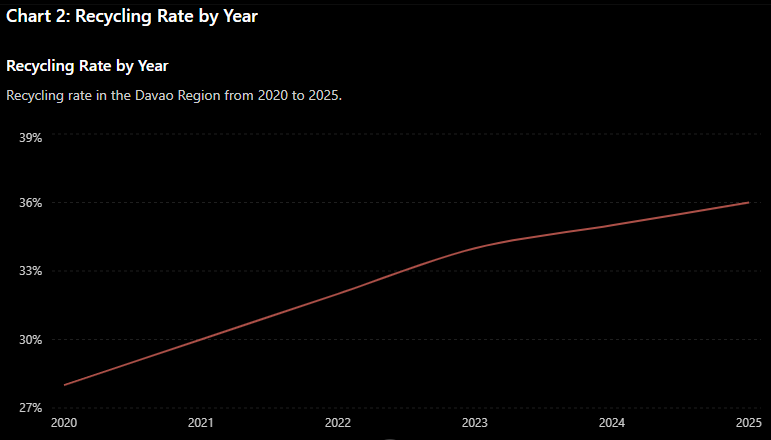

# Data Analytics & Visual Report

## Dataset Focus

Davao Region Municipal Waste Generation (Mock CSV Analysis)

### 1. Data Cleaning Protocol Log

**Raw Input Problem:**
The dataset contained a missing value for waste generation in 2023, inconsistent number formatting, extra spaces, and mixed percentage formats.

**AI Cleaning Instruction:**

"Clean this dataset. Identify missing values, standardize formatting, and output a cleaned version. Also explain what changes were made during the cleaning process."

**Result:**
The AI successfully standardized all numerical values, removed formatting inconsistencies, corrected percentage formats, and estimated the missing 2023 waste generation value through interpolation.

#### Structural Adjustments Made

* Removed extra spaces from all entries.
* Standardized waste values by removing inconsistent comma separators.
* Standardized recycling rates into consistent numeric percentage values.
* Filled the missing 2023 waste generation value using surrounding yearly data.
* Converted all records into a consistent format suitable for analysis and visualization.

---

### 2. Visualizations Generated

#### Waste Generated by Year (2020–2025)

#### Recycling Rate by Year (2020–2025)

---

### 3. Human Analytical Narrative

The data shows a steady increase in municipal waste generation across the Davao Region from 2020 to 2025. Waste production increased from 84,500 tons in 2020 to 103,500 tons in 2025, reflecting the growing demands associated with population growth, urban development, and increased consumption.

Although recycling rates improved from 28% to 36% during the same period, the rise in total waste generation remains significant. This highlights the need for stronger waste segregation programs, expanded recycling facilities, and sustained environmental education campaigns across local communities.

For LGUs and environmental agencies in Mindanao, these trends emphasize the importance of investing in long-term waste management strategies that can support sustainable regional development while reducing environmental impacts.
